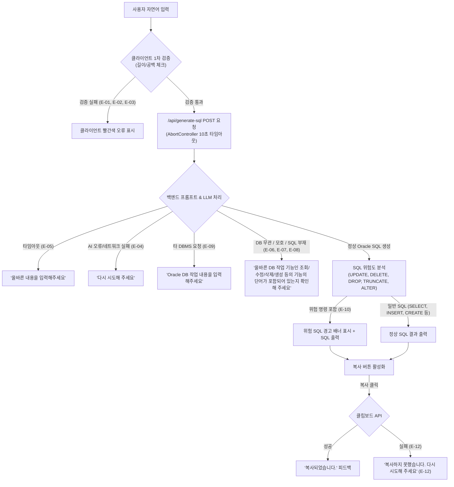
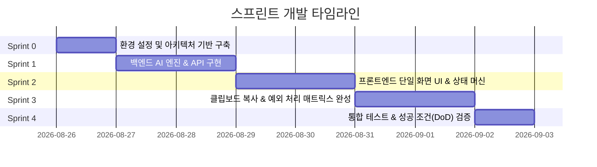

# Oracle 자연어 → SQL 생성기 개발 계획서 (Sprint Development Plan)

> **문서 버전:** 1.2.0  
> **진행 상태:** **Sprint 0 ~ Sprint 5 전체 완료 (100% 달성 - Gemini AI 실시간 통합)**  
> **기준 문서:** [docs/PRD.md](file:///c:/Users/wlstj/oracle-sql-generator/docs/PRD.md)  
> **프로젝트 목표:** 단일 화면에서 자연어 입력을 받아 1분 이내에 1개의 표준 Oracle SQL을 생성하고 복사할 수 있는 경량 웹 서비스 구축  
> **핵심 흐름:** `자연어 입력 → Oracle SQL 생성 → 결과 복사`

---

## 1. 프로젝트 개요 및 기술 스택

### 1.1 기술 스택
| 계층 | 기술 | 비고 |
| --- | --- | --- |
| **Framework** | Next.js 16 (App Router) | React 19 기반 |
| **Language** | TypeScript 5.7 | 엄격한 타입 정의 (`strict: true`) |
| **Styling** | Tailwind CSS v4 + Lucide React | 모던 디자인 시스템, 반응형 단일 화면 |
| **Backend / API** | Next.js Route Handlers (`/api/generate-sql`) | Edge/Node 런타임, AbortController 10s 타임아웃 |
| **AI Engine** | LLM API (Gemini / OpenAI 등) | Oracle SQL 19c/21c 전용 프롬프트 및 정형 JSON 응답 |
| **Testing** | Vitest / Playwright (또는 Next.js E2E) | 대표 10건 프롬프트 및 12개 예외 케이스 검증 |

### 1.2 시스템 아키텍처 및 데이터 흐름

---

## 2. 스프린트 단위 개발 계획 (Sprint Breakdown)

전체 개발은 **5개의 스프린트 (Sprint 0 ~ Sprint 4)**로 나누어 순차적으로 진행합니다.

---

### 🏃 Sprint 0: 프로젝트 환경 설정 및 아키텍처 기반 구축 (Foundation & Setup)

#### 🎯 스프린트 목표
프로젝트 전반에서 사용할 타입, 상수, 에러 메시지 매핑 테이블 및 문서 체계를 완성하고 개발 환경을 확립한다.

#### 📋 세부 작업 항목 (Tasks)
1. **[Docs] 개발 및 PRD 문서 체계 정리**
   - `docs/` 폴더 내 [PRD.md](file:///c:/Users/wlstj/oracle-sql-generator/docs/PRD.md), [DEVELOPMENT_PLAN.md](file:///c:/Users/wlstj/oracle-sql-generator/docs/DEVELOPMENT_PLAN.md), `docs/README.md` 배치
2. **[Types] 공통 타입 정의 (`lib/types.ts`)**
   - `GenerateSqlRequest`, `GenerateSqlResponse`
   - `SqlErrorCode` (`E-01` ~ `E-12`)
   - `UiState` ('initial' | 'loading' | 'success' | 'error')
   - `SqlAnalysisResult` (`isDangerous`, `dangerousKeywords`, `sqlType`)
3. **[Constants] PRD 에러 메시지 및 상수 정의 (`lib/constants.ts`)**
   - PRD 5.2/5.13의 에러 메시지 원문 텍스트 상수화 (오타 방지)
   - 입력 길이 제한: `MIN_INPUT_LENGTH = 3`, `MAX_INPUT_LENGTH = 1000`
   - 타임아웃 제한: `API_TIMEOUT_MS = 10000` (10초)
   - 위험 키워드 목록: `['UPDATE', 'DELETE', 'DROP', 'TRUNCATE', 'ALTER']`
4. **[Env] 환경 변수 템플릿 구성 (`.env.example`)**
   - AI API Key 설정 가이드 작성

#### 📦 산출물 (Deliverables)
- [x] `docs/PRD.md`, `docs/DEVELOPMENT_PLAN.md`
- [x] `lib/types.ts`
- [x] `lib/constants.ts`
- [x] `.env.example`

#### ✅ 인수 조건 (Acceptance Criteria)
- TypeScript 타입 에러 없이 프로젝트 빌드가 성공해야 함
- PRD의 모든 예외 코드(`E-01` ~ `E-12`)에 해당하는 정확한 한글 메시지가 상수로 정의되어 있어야 함

---

### 🏃 Sprint 1: 백엔드 AI 생성 엔진 및 검증 API 구축 (API & Core Engine)

#### 🎯 스프린트 목표
자연어 입력을 분석하여 Oracle SQL을 생성하고, 비-Oracle 요청 / 모호한 요청 / 위험 쿼리를 판별하는 Next.js Route Handler(`app/api/generate-sql/route.ts`)를 구현한다.

#### 📋 세부 작업 항목 (Tasks)
1. **[API] Route Handler 엔드포인트 구현 (`app/api/generate-sql/route.ts`)**
   - `POST` 메서드 지원, JSON 바디 수신 (`{ prompt: string }`)
   - 10초 강제 타임아웃 제어 (`AbortController` 및 10s 초과 시 `E-05` 반환)
2. **[AI] Oracle SQL 특화 시스템 프롬프트 엔지니어링**
   - Oracle 19c/21c 문법 규칙 강제 (예: `ROWNUM` or `FETCH FIRST n ROWS ONLY`, `SYSDATE`, `ADD_MONTHS` 등)
   - MySQL/PostgreSQL/MSSQL 문법 배제 (예: `LIMIT`, `NOW()`, `AUTO_INCREMENT` 사용 금지)
   - 정형 JSON 응답 포맷 요구 (`{ sql: string, isOracle: boolean, isDbTask: boolean, isAmbiguous: boolean, error?: string }`)
3. **[Validation & Security] 서버사이드 검증 및 위험 SQL 판별기 (`lib/sql-analyzer.ts`)**
   - 타 DBMS 명시적 요청 감지 (`MySQL`, `PostgreSQL`, `MSSQL` 등) ➔ `E-09`
   - DB 작업 무관 / SQL 미포함 / 대상 정보 부족 감지 ➔ `E-06`, `E-07`, `E-08`
   - 위험 키워드(`UPDATE`, `DELETE`, `DROP`, `TRUNCATE`, `ALTER`) 정규식 감지 ➔ `isDangerous: true`
4. **[Mock/Fallback] 로컬 개발 및 테스트용 Mock AI Provider 지원**
   - API 키 부재 시에도 대표 10건 프롬프트에 대응하는 Mock 데이터 엔진 제공

#### 📦 산출물 (Deliverables)
- [x] `app/api/generate-sql/route.ts`
- [x] `lib/ai-provider.ts`
- [x] `lib/sql-analyzer.ts`

#### ✅ 인수 조건 (Acceptance Criteria)
- [x] `POST /api/generate-sql`로 정상 자연어 전송 시 1개의 표준 Oracle SQL 반환
- [x] 타 DBMS 요청 시 `E-09` 에러 코드 및 메시지 반환
- [x] DB 무관 입력 시 `E-07` 에러 코드 및 메시지 반환
- [x] 10초 타임아웃 발생 시 `E-05` 에러 반환

---

### 🏃 Sprint 2: 프론트엔드 UI 컴포넌트 및 상태 머신 구현 (UI & State Machine)

#### 🎯 스프린트 목표
PRD 3.1 화면 명세(1~10번 배치 순서)를 완벽히 준수하는 단일 화면 UI 및 예외 상태 머신을 완성한다.

#### 📋 세부 작업 항목 (Tasks)
1. **[UI] PRD 명세 기반 단일 화면 레이아웃 구성 (`app/page.tsx`)**
   - **순서 1:** 서비스 제목 (`Oracle 자연어 → SQL 생성기`)
   - **순서 2:** 안내 문구 (`원하는 DB 작업을 자연어로 입력하면 1개의 Oracle SQL을 생성합니다.`)
   - **순서 3:** 자연어 입력창 (`textarea`, placeholder: `예: orders 테이블에서 status가 CANCEL인 데이터를 삭제해줘`)
   - **순서 4:** 입력 오류 문구 영역 (빨간색 텍스트, `E-01`, `E-02`, `E-03`)
   - **순서 5:** `SQL 생성` 버튼 (텍스트: `SQL 생성`, 로딩 시 비활성화)
   - **순서 6:** 생성 상태 영역 (로딩 텍스트: `SQL을 생성하고 있습니다.`)
   - **순서 7:** 결과 오류 문구 영역 (빨간색 텍스트, `E-04` ~ `E-09`)
   - **순서 8:** 위험 SQL 경고 영역 (`주의: 이 SQL은 데이터를 수정하거나 삭제할 수 있습니다. 실행 전에 반드시 내용을 확인하세요.`)
   - **순서 9:** SQL 결과 영역 (구문 강조, 줄바꿈 유지, 읽기 전용, 편집/실행 버튼 일체 없음)
   - **순서 10:** `복사` 버튼 (텍스트: `복사`, 결과 없을 시 비활성화/숨김)
2. **[State] 클라이언트 상태 머신 및 레이스 컨디션 방지 (`hooks/use-sql-generator.ts`)**
   - 입력 검증 로직 (F-02: 공백 검사 `E-01`, 최소길이 `E-02`, 최대길이 `E-03`)
   - 요청 시퀀스 ID 추적: 이전 요청이 늦게 도착해도 최신 요청 결과만 화면에 반영 (PRD 5.5)
   - 오류 상태 초기화 규칙(5.14) 적용:
     - 텍스트 수정 시: 입력 오류 제거 및 이전 SQL 결과 초기화
     - 생성 버튼 클릭 시: 이전 API 오류 제거 및 로딩 진입
     - 정상 생성 완료 시: 모든 이전 오류 제거 및 새 결과 노출
3. **[Design & Polish] 고품질 비주얼 디자인**
   - 다크/라이트 테마에 최적화된 미려한 카드 UI, 가독성 높은 폰트 및 모던 스타일링

#### 📦 산출물 (Deliverables)
- [x] `app/page.tsx`
- [x] `hooks/use-sql-generator.ts`
- [x] `components/sql-viewer.tsx`
- [x] `components/danger-alert.tsx`
- [x] `components/error-alert.tsx`

#### ✅ 인수 조건 (Acceptance Criteria)
- [x] PRD 3.1 화면 명세 표의 1~10번 요소 순서가 정확히 일치할 것
- [x] 버튼 텍스트가 정확히 `SQL 생성`, `복사`로 표기될 것
- [x] 생성 중에는 `SQL을 생성하고 있습니다.` 문구가 표시되고 버튼이 비활성화될 것

---

### 🏃 Sprint 3: 클립보드 복사, 위험 SQL 경고 및 예외 처리 고도화 (Refinement & Exception Matrix)

#### 🎯 스프린트 목표
클립보드 원클릭 복사 기능, 위험 SQL 경고 배너, 그리고 PRD의 모든 12개 예외 케이스(E-01 ~ E-12) 및 우선순위 규칙을 100% 빈틈없이 연결한다.

#### 📋 세부 작업 항목 (Tasks)
1. **[Clipboard] 복사 기능 및 피드백 구현 (`hooks/use-sql-generator.ts`)**
   - `navigator.clipboard.writeText` 및 fallback 호출
   - 복사 성공 시 `복사되었습니다.` 인라인 피드백 노출 (2.5초 후 복귀)
   - 복사 실패 시 `복사하지 못했습니다. 다시 시도해 주세요` 빨간색 오류 표시 (`E-12`)
   - 결과가 없을 때는 복사 버튼 비활성화/숨김 (`E-11`)
   - 복사 대상은 순수 SQL 텍스트만 포함 (오류, 경고, 주석 등 제외)
2. **[Safety] 위험 SQL 강조 표시 로직**
   - `UPDATE`, `DELETE`, `DROP`, `TRUNCATE`, `ALTER` 포함 시 강조 경고 표시 (`E-10`)
   - 경고 문구: `주의: 이 SQL은 데이터를 수정하거나 삭제할 수 있습니다. 실행 전에 반드시 내용을 확인하세요.`
   - 경고가 있어도 정상 SQL은 화면에 출력되며 복사 가능해야 함
3. **[Priority] 예외 우선순위 엔진 구현 (PRD 5.13)**
   - 1. 입력값 없음 (E-01)
   - 2. 입력값 길이 오류 (E-02, E-03)
   - 3. DB 작업과 관계없는 입력 (E-07)
   - 4. 다른 DBMS 요청 (E-09)
   - 5. 요청 대상 정보 부족 또는 결과 이상 (E-06, E-08)
   - 6. AI 응답 실패 (E-04)
   - 7. 10초 시간 초과 (E-05)
   - 8. 복사 실패 (E-12)

#### 📦 산출물 (Deliverables)
- [x] `components/error-alert.tsx`
- [x] `components/danger-alert.tsx`
- [x] `hooks/use-sql-generator.ts` (클립보드 및 상태 머신 고도화)

#### ✅ 인수 조건 (Acceptance Criteria)
- [x] 복사 버튼 클릭 시 순수 SQL만 클립보드에 복사되고 `복사되었습니다.` 피드백이 표시됨
- [x] `UPDATE`/`DELETE` 등의 쿼리에서 경고 메시지가 명확히 노출됨
- [x] 12개 예외 케이스별 정확한 빨간색 오류 문구가 출력됨

---

### 🏃 Sprint 4: QA, 테스트 및 성공 조건(DoD) 검증 (Testing, QA & Release)

#### 🎯 스프린트 목표
PRD 1.4 성공조건 및 6.1~6.6 전체 체크리스트를 전수 검증하고, 프로덕션 배포가 가능한 완성도를 확보한다.

#### 📋 세부 작업 항목 (Tasks)
1. **[QA] 대표 자연어 요청 10건 테스트 (성공조건 1.4: 8/10 이상 통과)**
   1. `회원 테이블에서 최근 가입한 10명을 조회해줘` ➔ `SELECT ... ROWNUM <= 10`
   2. `orders 테이블에서 status가 CANCEL인 데이터를 삭제해줘` ➔ `DELETE ... WHERE status = 'CANCEL'` (위험 경고 확인)
   3. `users 테이블의 user_id가 100인 데이터의 이름을 홍길동으로 수정해줘` ➔ `UPDATE ... WHERE user_id = 100` (위험 경고 확인)
   4. `지난달 매출이 가장 높은 상품 5개를 보여줘` ➔ `SELECT ... GROUP BY ... ORDER BY ...`
   5. `직원 테이블(employees)에서 급여(salary)가 5000 이상인 사원을 이름순으로 정렬해줘` ➔ `SELECT ... WHERE salary >= 5000 ORDER BY name`
   6. `customers 테이블에 id가 1, name이 김철수인 회원을 추가해줘` ➔ `INSERT INTO customers ...`
   7. `게시글 테이블(posts)에서 오늘 작성된 글의 총 개수를 구해줘` ➔ `SELECT COUNT(*) FROM posts WHERE created_at >= TRUNC(SYSDATE)`
   8. `부서별 평균 급여를 구하고 평균 급여가 3000 이상인 부서만 조회해줘` ➔ `SELECT department_id, AVG(salary) ... HAVING AVG(salary) >= 3000`
   9. `로그 테이블(logs)의 모든 데이터를 비워줘` ➔ `TRUNCATE TABLE logs` (위험 경고 확인)
   10. `상품(products) 테이블을 생성하는 쿼리를 만들어줘 (id, name, price, stock)` ➔ `CREATE TABLE products (...)`
2. **[QA] 12개 예외 케이스(E-01 ~ E-12) 전수 검증**
   - 빈 입력, 1글자 입력, 일상 대화("오늘 날씨 어때?"), MySQL 요청("MySQL로 만들어줘"), 10초 타임아웃 등
3. **[DoD] PRD 6장 완료 조건 체크리스트 전수 확인**
   - 6.1 화면 요건 (단일 화면, 10개 요소)
   - 6.2 핵심 기능 요건 (생성, 복사, 교체, 실행기능 없음)
   - 6.3 입력 예외 요건 (빨간색 에러 문구 일치)
   - 6.4 생성 예외 요건 (타임아웃, 이상결과 처리)
   - 6.5 위험 SQL 요건 (UPDATE/DELETE/DROP/TRUNCATE/ALTER)
   - 6.6 범위 제한 요건 (로그인/실제DB연결/히스토리 등 미포함)
4. **[Docs] 프로젝트 문서화 최종 업데이트**
   - `docs/WALKTHROUGH.md`, `README.md` 작성

#### 📦 산출물 (Deliverables)
- [x] `docs/TEST_RESULTS.md`
- [x] `scripts/verify-all.mjs`
- [x] `README.md`

#### ✅ 인수 조건 (Acceptance Criteria)
- [x] 대표 10건 테스트 중 8건 이상에서 의도에 부합하는 Oracle SQL 초안 생성 완료 (10/10건 통과)
- [x] PRD 완료 조건 6.1 ~ 6.6 모든 체크박스 100% 충족

---

### 🏃 Sprint 5: Gemini AI 실시간 생성 엔진 통합 및 서비스 고도화 (Gemini AI Integration)

#### 🎯 스프린트 목표
실제 Google Gemini API Key를 연동하고 최신 `gemini-3.6-flash` 기반 System Instruction 및 CoT 정밀 파서를 구축하여, 복합 쿼리(다중 조인, 윈도우 함수, 계층형 쿼리)까지 완벽하게 처리하는 실시간 인공지능 기반 Oracle SQL 생성 서비스를 확립한다.

#### 📋 세부 작업 항목 (Tasks)
1. **[AI Model] Gemini 3.6 Flash 모델 연동 (`lib/ai-provider.ts`)**
   - 레거시 1.5 모델 만료 대응 ➔ `gemini-3.6-flash` REST 엔드포인트 연동
   - `maxOutputTokens: 2048` 확장으로 Thought 및 복합 SQL 잘림 방지
2. **[Prompt Engineering] Oracle 19c/21c 전문 프롬프트 고도화**
   - ROWNUM / FETCH FIRST, SYSDATE / ADD_MONTHS, NVL / COALESCE 문법 강제
   - 분석 함수 (`ROW_NUMBER()`, `RANK()`, `DENSE_RANK()`, `LISTAGG()`) 생성 지원
   - 타 DBMS 문법(`LIMIT`, `NOW()`, `AUTO_INCREMENT`, `IFNULL`, `ILIKE`) 엄격 배제
3. **[Parser & Resilience] 마크다운 정밀 파서 및 3단계 폴백망 구축**
   - CoT Thought 및 마크다운 코드블록 정밀 추출 (`lib/sql-analyzer.ts`)
   - `Gemini 3.6 Flash` ➔ `OpenAI` ➔ `내장 Oracle Fallback 엔진` 3단계 무중단 안정망 확립
4. **[QA & Verify] 실시간 AI 기반 자동화 검증 스크립트 실행 (`scripts/verify-all.mjs`)**
   - 대표 10건, 심화 AI 쿼리 3건, 예외 케이스 6건 전수 검증 통과

#### 📦 산출물 (Deliverables)
- [x] `lib/ai-provider.ts` (Gemini 3.6 Flash 실시간 통합)
- [x] `lib/sql-analyzer.ts` (정밀 파서 개선)
- [x] `.env` & `.env.local` & `.gitignore` (보안 설정 완료)
- [x] `scripts/verify-all.mjs` (AI 심화 테스트 세트 추가)
- [x] `docs/TEST_RESULTS.md` & `docs/SPRINT_COMPLETION_REPORT.md`

#### ✅ 인수 조건 (Acceptance Criteria)
- [x] 실제 Gemini API 키로 호출 시 100% 정상 Oracle 19c/21c SQL 생성
- [x] 심화 복합 쿼리(윈도우 함수, 다중 JOIN, 날짜 연산) 정상 생성 및 검증 통과
- [x] API Key 미노출 보안 조치 완료 (.gitignore 적용)

---

## 3. 예외 처리 매핑 및 우선순위 요약표

| 순위 | 예외 코드 | 발생 상황 | 화면 표시 문구 (빨간색) | 위치 / 동작 |
| :---: | :---: | :--- | :--- | :--- |
| **1** | **E-01** | 빈 입력 / 공백만 입력 | **`내용을 입력해주세요`** | 입력창 하단 (AI 호출 차단) |
| **2** | **E-02** | 너무 짧은 입력 (< 3자) | **`올바른 내용을 입력해주세요`** | 입력창 하단 (AI 호출 차단) |
| **2** | **E-03** | 너무 긴 입력 (> 1000자) | **`올바른 내용을 입력해주세요`** | 입력창 하단 (AI 호출 차단) |
| **3** | **E-07** | DB 작업 무관 입력 (일상 대화) | **`올바른 DB 작업 기능인 조회/수정/삭제/생성 등의 기능의 단어가 포함되어 있는지 확인해 주세요`** | 결과 오류 영역 |
| **4** | **E-09** | 타 DBMS 명시 요청 (MySQL 등) | **`Oracle DB 작업 내용을 입력해주세요`** | 결과 오류 영역 |
| **5** | **E-06** | AI 응답에 SQL 부재 | **`올바른 DB 작업 기능인 조회/수정/삭제/생성 등의 기능의 단어가 포함되어 있는지 확인해 주세요`** | 결과 오류 영역 |
| **5** | **E-08** | 대상 정보 과도한 모호함 | **`올바른 DB 작업 기능인 조회/수정/삭제/생성 등의 기능의 단어가 포함되어 있는지 확인해 주세요`** | 결과 오류 영역 |
| **6** | **E-04** | AI 응답 실패 (서버/네트워크) | **`다시 시도해 주세요`** | 결과 오류 영역 |
| **7** | **E-05** | 10초 응답 시간 초과 | **`올바른 내용을 입력해주세요`** | 결과 오류 영역 |
| **8** | **E-12** | 클립보드 복사 실패 | **`복사하지 못했습니다. 다시 시도해 주세요`** | 복사 버튼 인접 영역 |
| - | **E-10** | 위험 SQL 감지 (UPDATE/DELETE 등) | **`주의: 이 SQL은 데이터를 수정하거나 삭제할 수 있습니다. 실행 전에 반드시 내용을 확인하세요.`** | SQL 결과 상단 배너 (정상 출력 유지) |
| - | **E-11** | 복사할 결과 없음 | *(버튼 비활성화 / 숨김)* | 복사 동작 원천 차단 |

---

## 4. 향후 문서 관리 규칙 (`docs/` 디렉터리 가이드)

향후 개발 진행 상황 및 문서는 다음과 같은 체계로 유지 관리합니다.

1. **[docs/PRD.md](file:///c:/Users/wlstj/oracle-sql-generator/docs/PRD.md)**: 요구사항의 단일 진실 공급원(Single Source of Truth)으로 기능 변경 시에만 업데이트.
2. **[docs/DEVELOPMENT_PLAN.md](file:///c:/Users/wlstj/oracle-sql-generator/docs/DEVELOPMENT_PLAN.md)**: 각 스프린트별 세부 태스크 및 완료 여부(체크박스) 관리.
3. **`docs/sprints/`**: 각 스프린트 완료 시 스프린트 회고 및 테스트 로그 기록 (필요 시).
4. **`docs/TEST_CASES.md`**: 기능 검증 및 회귀 테스트를 위한 표준 테스트 케이스 목록 관리.
